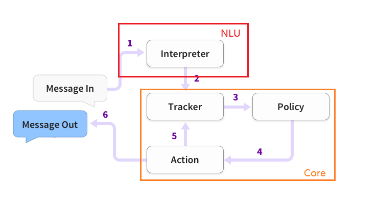

# Rasa
[官方文档](https://rasa.com/docs/rasa)

## Rasa 消息处理架构

1. 消息被接收并传递给`Interpreter`，它将其转换为包含原始文本、意图和实体的字典。这部分由NLU处理。
2. `Tracker` 是跟踪对话状态的对象。
3. 策略接收跟踪器的当前状态。
4. 该政策选择接下来采取的行动。
5. 选择的操作由跟踪器记录。
6. 响应被发送给用户。